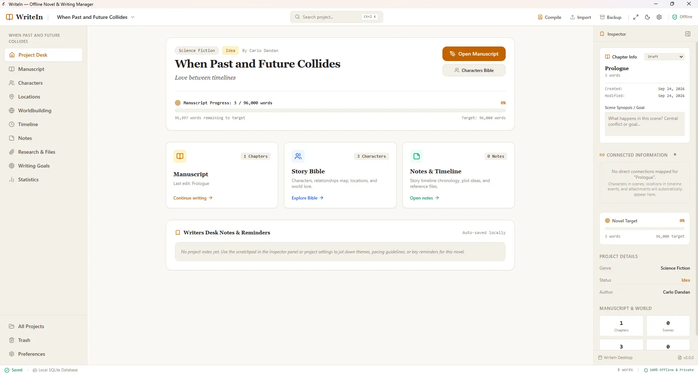

# WriteIn — Offline Novel & Writing Manager

[](https://github.com/carlodandan/writein/releases/tag/v4.2.1)
[]()
[%20%7C%20Tauri%202.0-indigo.svg)]()
[-orange.svg)]()
[]()
[]()

**WriteIn** is a private, offline-first desktop studio crafted specifically for novelists, authors, and long-form fiction writers. It brings together the organizational depth of tools like Scrivener, the focus of a minimalist distraction-free writing desk, and an interconnected story bible—with zero cloud lock-in, zero telemetry, and complete data sovereignty.

> **"Scrivener-lite + personal writing notebook + story database"**



---

## 🌟 Key Highlights

- **100% Offline & Private**: Zero accounts, zero mandatory cloud services, zero telemetry, and zero ads. All manuscripts live strictly on your local machine.
- **Isolated SQLite Storage**: Each novel project is saved in its own self-contained database (`%APPDATA%/WriteIn/projects/{project-id}/project.db`), enabling effortless portability, backups, and snapshotting.
- **A Modern Writer's Desk**: Distraction-free typography, warm paper palettes (**Warm Paper** & **Midnight Ink**), and a balanced three-pane workspace tailored for creative flow.
- **Manuscript Hierarchy & Binder**: Multi-act novel structure (Parts, Chapters, Scenes) with fluid drag-and-drop reordering, progress tracking states (*Idea*, *Outline*, *Draft*, *Revised*, *Final*), and live word count rollups.
- **Rich Prose Editor**: Clean formatting (H1–H3, bold, italic, quotes, scene dividers), in-document Find & Replace (`Ctrl+F`), 1,000ms debounced autosave, manual save (`Ctrl+S`), and Distraction-Free Typewriter Mode (`F11`).
- **Smart Clipboard Paste Sanitization**: Configurable paste behavior (`match-style`, `keep-format`, `plain-text`), stripping extraneous external styles and fonts while preserving semantic italics and bolding. Quick plain-text paste via `Ctrl+Shift+V`.
- **MS Word (.docx) Manuscript Compiler**: One-click compilation adhering strictly to publishing industry standards: 1-inch margins, 12pt Times New Roman, 1.5 line spacing, 0.5-inch paragraph indents, front-matter title page, and scene breaks (`* * *`). Also supports Markdown (`.md`) and Plain Text (`.txt`).
- **Intelligent Manuscript Importer**: Seamlessly import existing text or Markdown files with automated chapter header recognition and binder hierarchy generation.
- **Snapshots & Version History**: Capture complete manuscript versions before major revisions, inspect side-by-side diffs, and restore earlier drafts non-destructively.
- **Writing Goals & Session Velocity**: Set daily word targets, track typing velocity (words-per-minute), analyze session duration, and maintain productive writing habits with detailed session logs.
- **Story Bible & Visual Cast Graph**: Character dossiers with personality traits, motivations, and custom attributes, linked via an interactive visual SVG relationship map with radial positioning.
- **Settings & Worldbuilding**: Location dossiers with sensory atmosphere quotes and a 9-domain lore encyclopedia with bidirectional scene backlinks.
- **Timeline & Chronology**: Event tracking with custom fantasy calendars, importance flags, participating characters, and chapter links.
- **Global Project Search (`Ctrl + K`)**: Lightning-fast SQLite search across scenes, characters, lore, timeline, notes, and tags with keyword highlighting.
- **End-to-End Encrypted Device Transfer**: Zero-knowledge, short-lived (10-minute pairing codes) library migration between desktop PCs using client-side **Web Crypto** (ECDH P-256 + HKDF + AES-256-GCM) with atomic SQLite imports and conflict resolution.
- **Native Windows Integrations**: Deep link protocol (`writein://new`), custom taskbar identity, and built-in Tauri v2 auto-updater with minisign cryptographic verification.

---

## 📚 Documentation Directory

WriteIn includes a complete suite of documentation for authors and developers:

| Document | Description |
| :--- | :--- |
| 📖 **[TUTORIAL.md](docs/TUTORIAL.md)** | **Author's Step-by-Step User Guide**: Complete manual covering the binder, editor, story bible, compiling, snapshots, goals, and device transfer. |
| 🏛️ **[ARCHITECTURE.md](docs/ARCHITECTURE.md)** | **System Architecture & Design**: C4 component diagrams, subsystem designs, Web Crypto pipeline, and security model. |
| 🗄️ **[DATABASE.md](docs/DATABASE.md)** | **Database Schema & Migrations**: Complete SQLite schema (Migrations 001–006), ER diagrams, indexing, and cascade rules. |
| 🔌 **[API.md](docs/API.md)** | **IPC & Developer Reference**: Tauri commands reference, TypeScript domain services, and IPC payload types. |
| 🧪 **[TESTING.md](docs/TESTING.md)** | **Testing Strategy**: Comprehensive guide to the 41 Vitest frontend suites and 37 Rust unit tests (211 total tests). |
| 📜 **[CHANGELOG.md](CHANGELOG.md)** | **Release History**: Complete version history following Keep a Changelog standards from v1.0.0 to v4.2.1. |

---

## 🛠️ Technology Stack

- **Desktop Shell**: [Tauri 2.0](https://v2.tauri.app/)
- **Backend Core**: Rust (memory-safe, high-performance)
- **Local Database**: SQLite 3 via `rusqlite` (bundled, WAL mode, foreign key cascades)
- **Frontend**: React 19 + TypeScript (strict mode)
- **Editor Engine**: TipTap / ProseMirror
- **Styling**: Tailwind CSS v4 ("A modern writer's desk" paper & ink design system)
- **Cryptography**: Web Crypto API (ECDH P-256, HKDF-SHA256, AES-256-GCM)
- **Compilation**: Custom OOXML `.docx` generator, Markdown/Plain Text exporters
- **Icons**: Lucide React
- **Test Runners**: Vitest (frontend) & Cargo Test (backend)

---

## 💻 Development & Build Commands

### Prerequisites
- Node.js 20.19+ or 22.12+ & `pnpm`
- Rust toolchain (`cargo`, `rustc`)
- Windows 10/11 with WebView2 runtime

### Install Dependencies
```pwsh
pnpm install
```

### Launch Development Desktop App
```pwsh
pnpm tauri dev
```

### Run Browser Preview (with simulated IPC fallback)
```pwsh
pnpm dev
```

### Run Automated Tests
```pwsh
# Run all Vitest frontend suites (41 test files, 174 tests)
pnpm test

# Run all Rust backend tests (37 unit tests)
cd src-tauri
cargo test
```

### Version Synchronization
To safely bump the version across `package.json`, `Cargo.toml`, `tauri.conf.json`, `splashscreen.html`, and `website/` with UTF-8 encoding protection:
```pwsh
pnpm version:set <new-version>
```

### Build Production Desktop Application
```pwsh
pnpm build
pnpm tauri build
```
The compiled installer (`.msi` and `.exe`) will be generated in `src-tauri/target/release/bundle/`.

---

## 📁 Data Storage Location

On Windows, all projects and settings are saved under your local user profile:
```text
C:\Users\<YourUsername>\AppData\Roaming\WriteIn\
├── app.db                                     # App preferences & global registry
└── projects\
    └── {project-id}\                          # Self-contained novel directory
        ├── project.db                         # SQLite database for this novel
        ├── attachments\                       # Local images, PDFs, and maps
        ├── versions\                          # Document snapshot archives
        └── backups\                           # Automatic archives before destructive ops
```

To backup your novel manually, simply copy the `{project-id}` directory or use WriteIn's built-in **Export .writein Backup** feature.
