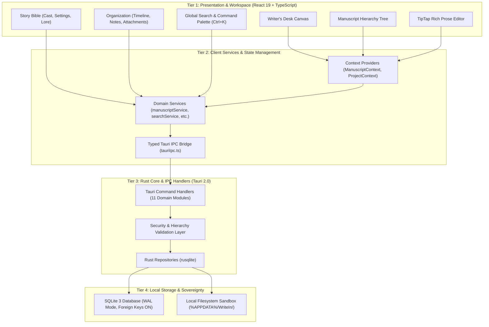
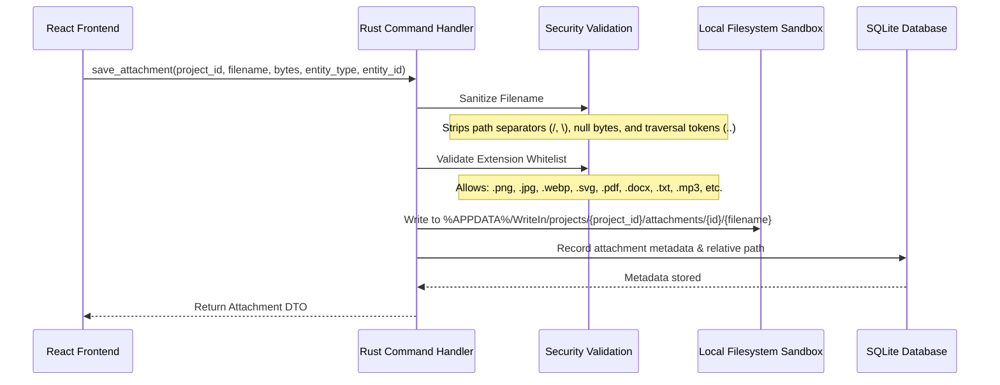
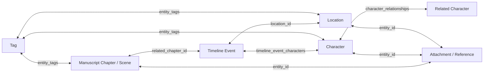

# Architecture & System Design — WriteIn

WriteIn is an offline-first, local-first Windows desktop application tailored for long-form fiction writers and novelists (*"Scrivener-lite + personal writing notebook + story database"*).

---

## 1. High-Level Architecture (C4 Component Model)

WriteIn strictly isolates responsibilities across four clean architectural tiers:



---

## 2. Directory Layout & Local Data Sovereignty

All user data lives strictly on the local machine under the OS application data path (`%APPDATA%/WriteIn/` on Windows) without any third-party cloud services or telemetry:

```text
%APPDATA%/WriteIn/
├── app.db                                     # Global application state & project registry
└── projects/
    └── {project-id}/                          # Isolated project sandbox
        ├── project.db                         # Complete self-contained SQLite novel database
        ├── attachments/                       # Secure local file repository
        │   └── {attachment-id}/
        │       └── {sanitized_filename}       # Character portraits, reference PDFs, maps
        ├── versions/                          # Document snapshot archives
        └── backups/                           # Automatic snapshots before destructive ops
```

### Benefits of Self-Contained Project Databases
1. **Zero Cross-Contamination**: Corruption in one project cannot impact other books.
2. **Instant Backups**: An entire novel is backed up by copying a single directory.
3. **Portability**: Writers can transfer their `{project-id}` directory to another computer with zero cloud dependence.

---

## 3. Technology Stack

- **Tauri 2.0**: Native desktop runtime with lightweight OS webview.
- **Rust**: Memory-safe, high-performance backend managing SQLite operations, filesystem access, path sanitization, and data migrations.
- **SQLite 3 (`rusqlite` bundled)**: Embedded transactional database running in WAL mode with foreign keys enabled.
- **React 19 & TypeScript**: Strict type-safe reactive UI.
- **Tailwind CSS v4**: High-speed utility styling configured with "A modern writer's desk" paper and ink design tokens.
- **TipTap / ProseMirror**: Robust, extensible rich-text editing engine.
- **Vitest & React Testing Library**: Unit and integration test suite.
- **Lucide React**: Crisp, accessible iconography.

---

## 4. Subsystem Architectures

### A. Manuscript & Document Subsystem (Phase 2)
- **Hierarchy Structure**: Directed acyclic tree: `Folder (Part) -> Chapter -> Scene`.
- **Validation Engine**: Rust validates moves to prevent circular hierarchies ($O(N)$ cycle detection using recursive ancestor queries).
- **Word Count Rollup**: When scene documents are saved, the backend updates the scene word count and recursively rolls up total word counts to parent chapters and parts in a single transaction.
- **Autosave Engine**: 1,000ms debounced auto-persist with unmount/window beforeunload flushes to ensure zero lost words.

### B. Story Bible & Cast Graph (Phase 3)
- **Character Dossiers**: Stores narrative roles, personality profiles, and dynamic JSON custom fields.
- **Visual Relationship Map**: Interactive SVG network with draggable nodes, zoom/pan transform controls, and relational edge labels.
- **Lore Encyclopedia**: Two-column categorized lore manager covering 9 domains with real-time tag filtering.

### C. Knowledge Management & Timeline (Phase 4)
- **Fictional Dates Engine**: Distinguishes between sortable collation keys (`date_value`) and rich fantasy date labels (`date_label` e.g., *"3rd Year of the Red Moon"*).
- **Categorized Notebook**: Multi-category notes with quick capture, search, tag association, pinning, and soft archiving.
- **Project-wide Global Search**: Fast SQLite queries with indexed substring matching, multi-entity categorization, and `<mark>` text highlighting.

---

## 5. Security & Attachment Sandbox Architecture

WriteIn enforces strict filesystem sandboxing when handling user attachments:



---

## 6. Backlinks & Cross-Linking Architecture

The cross-linking engine automatically computes a bidirectional knowledge graph across all project entities without duplicate linking tables:



When any entity is selected, `get_related_content` queries the graph to present all connected entities in the right-hand **Inspector** panel.

---

## 7. Crash Resilience & Data Safety

1. **Write-Ahead Logging (WAL)**: SQLite writes changes to a `.db-wal` file sequentially, preventing corruption in case of unexpected shutdown or power loss.
2. **Atomic Multi-Entity Operations**: Tree reordering, node duplication, and status updates run inside atomic SQL transactions.
3. **Save-Before-Navigate**: Switching chapters or closing the application forcibly flushes any uncommitted keystroke buffer.
4. **Non-Destructive Deletions**: Deleting manuscript nodes requires explicit confirmation, preserving authorial intent.
