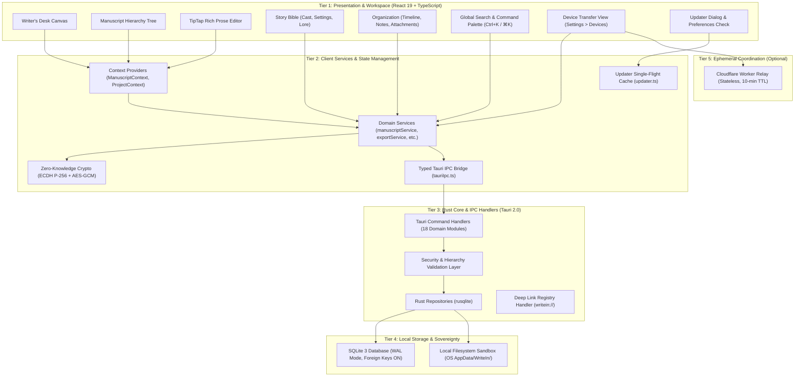
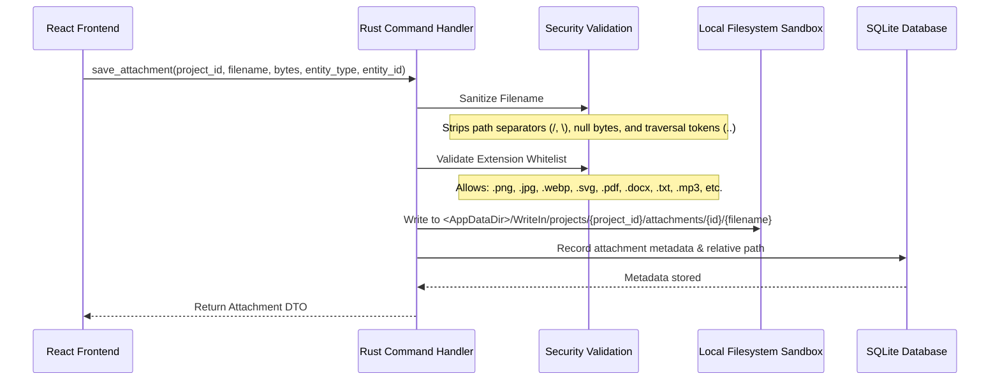
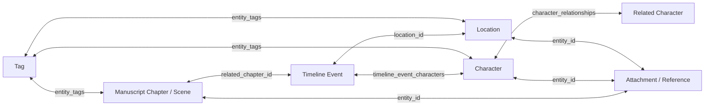

# Architecture & System Design — WriteIn

WriteIn is an offline-first, local-first multi-platform desktop application (Windows, macOS, Linux) tailored for long-form fiction writers and novelists (*"Scrivener-lite + personal writing notebook + story database"*).

---

## 1. High-Level Architecture (C4 Component Model)

WriteIn strictly isolates responsibilities across clean architectural tiers:


```mermaid
graph TD
    subgraph UI ["Tier 1: Presentation & Workspace (React 19 + TypeScript)"]
        Desk["Writer's Desk Canvas"]
        Tree["Manuscript Hierarchy Tree"]
        Editor["TipTap Rich Prose Editor"]
        Bible["Story Bible (Cast, Settings, Lore)"]
        Org["Organization (Timeline, Notes, Attachments)"]
        Palette["Global Search & Command Palette (Ctrl+K / ⌘K)"]
        TransferUI["Device Transfer View (Settings > Devices)"]
        UpdaterUI["Updater Dialog & Preferences Check"]
    end

    subgraph Service ["Tier 2: Client Services & State Management"]
        Contexts["Context Providers (ManuscriptContext, ProjectContext)"]
        Services["Domain Services (manuscriptService, exportService, etc.)"]
        Crypto["Zero-Knowledge Crypto (ECDH P-256 + AES-GCM)"]
        UpdaterLib["Updater Single-Flight Cache (updater.ts)"]
        IPC["Typed Tauri IPC Bridge (tauriIpc.ts)"]
    end

    subgraph Backend ["Tier 3: Rust Core & IPC Handlers (Tauri 2.0)"]
        Commands["Tauri Command Handlers (18 Domain Modules)"]
        Validation["Security & Hierarchy Validation Layer"]
        Repos["Rust Repositories (rusqlite)"]
        DeepLink["Deep Link Registry Handler (writein://)"]
    end

    subgraph Storage ["Tier 4: Local Storage & Sovereignty"]
        SQLite["SQLite 3 Database (WAL Mode, Foreign Keys ON)"]
        Filesystem["Local Filesystem Sandbox (OS AppData/WriteIn/)"]
    end

    subgraph Relay ["Tier 5: Ephemeral Coordination (Optional)"]
        Worker["Cloudflare Worker Relay (Stateless, 10-min TTL)"]
    end

    Desk --> Contexts
    Tree --> Contexts
    Editor --> Contexts
    Bible --> Services
    Org --> Services
    Palette --> Services
    TransferUI --> Services
    UpdaterUI --> UpdaterLib

    Contexts --> Services
    Services --> Crypto
    Services --> IPC
    TransferUI --> Worker
    IPC --> Commands
    Commands --> Validation
    Validation --> Repos
    Repos --> SQLite
    Repos --> Filesystem
```

---

## 2. Directory Layout & Local Data Sovereignty

All user data lives strictly on the local machine under the OS application data path (`%APPDATA%/WriteIn/` on Windows, `~/Library/Application Support/WriteIn/` on macOS, and `~/.local/share/WriteIn/` on Linux) without any third-party cloud services or telemetry:

```text
<AppDataDir>/WriteIn/
├── app.db                                     # Global application state & project registry
└── projects/
    └── {project-id}/                          # Isolated project sandbox
        ├── project.db                         # Complete self-contained SQLite novel database
        ├── attachments/                       # Secure local file repository
        │   └── {attachment-id}/
        │       └── {sanitized_filename}       # Character portraits, reference PDFs, maps
        ├── versions/                          # Document snapshot archives
        └── backups/                           # Automatic snapshots before destructive ops
```

### Benefits of Self-Contained Project Databases
1. **Zero Cross-Contamination**: Corruption in one project cannot impact other books.
2. **Instant Backups**: An entire novel is backed up by copying a single directory.
3. **Portability**: Writers can transfer their `{project-id}` directory to another computer with zero cloud dependence.

---

## 3. Technology Stack

- **Desktop Shell**: [Tauri 2.0](https://v2.tauri.app/)
- **Backend Core**: Rust (memory-safe, high-performance)
- **Local Database**: SQLite 3 (`rusqlite` bundled) running in WAL mode with foreign keys enabled.
- **Frontend**: React 19 + TypeScript (strict mode)
- **Editor Engine**: TipTap / ProseMirror
- **Styling**: Tailwind CSS v4 ("A modern writer's desk" paper and ink design tokens)
- **Cryptography**: Web Crypto API (ECDH P-256, HKDF-SHA256, AES-256-GCM)
- **Icons**: Lucide React
- **Test Runners**: Vitest (frontend) & Cargo Test (backend)

---

## 4. Subsystem Architectures

### A. Manuscript & Document Subsystem
- **Hierarchy Structure**: Directed acyclic tree: `Folder (Part) -> Chapter -> Scene`.
- **Validation Engine**: Rust validates moves to prevent circular hierarchies ($O(N)$ cycle detection using recursive ancestor queries).
- **Word Count Rollup**: When scene documents are saved, the backend updates the scene word count and recursively rolls up total word counts to parent chapters and parts in a single transaction.
- **Autosave Engine**: 1,000ms debounced auto-persist with unmount/window beforeunload flushes to ensure zero lost words.

### B. Story Bible & Cast Graph
- **Character Dossiers**: Stores narrative roles, personality profiles, and dynamic JSON custom fields.
- **Visual Relationship Map**: Interactive SVG network with draggable nodes, zoom/pan transform controls, and relational edge labels.
- **Lore Encyclopedia**: Two-column categorized lore manager covering 9 domains with real-time tag filtering.

### C. Knowledge Management & Timeline
- **Fictional Dates Engine**: Distinguishes between sortable collation keys (`date_value`) and rich fantasy date labels (`date_label` e.g., *"3rd Year of the Red Moon"*).
- **Categorized Notebook**: Multi-category notes with quick capture, search, tag association, pinning, and soft archiving.
- **Project-wide Global Search**: Fast SQLite queries with indexed substring matching, multi-entity categorization, and `<mark>` text highlighting.

### D. Writing Tools, Goals & Session Velocity
- **Writing Goals**: Tracks daily, chapter, and overall project target word counts with progress streaks and percentage completion.
- **Writing Sessions**: Measures duration in seconds and net words added during continuous writing intervals, computing writing velocity (words-per-minute).
- **Manuscript Snapshots & Version History**: Captures full document snapshots before major rewrites, providing side-by-side diff comparison and one-click restoration.
- **Paste Sanitization**: Smart clipboard processing (`pasteSanitizer.ts`) with user-configurable behavior (`match-style`, `keep-format`, `plain-text`), stripping external font declarations and CSS while preserving semantic formatting.

### E. Manuscript Compilation & Importer Engine
- **MS Word (.docx) Compilation**: Generates native Office Open XML packages formatted to industry publishing standards (1-inch margins, 12pt Times New Roman, 1.5 line spacing, 0.5-inch paragraph indents, front-matter title page, and scene breaks).
- **Markdown & Plain Text Export**: Full manuscript export with configurable scene dividers and front-matter inclusion.
- **Intelligent Importer**: Splits uploaded text or pasted manuscripts into binder nodes automatically by matching chapter and act headings via regular expressions.

### F. Trash Can & Data Recovery
- **Non-Destructive Deletion**: Deleted entities (nodes, characters, locations, lore, notes) are serialized into JSON payloads in `trash_items`.
- **Atomic Restoration**: Trashed items can be previewed, permanently purged, or restored into the live SQLite database in an atomic transaction.

### G. Zero-Knowledge Device-to-Device Transfer
- **Ephemeral Pairing Sessions**: Devices pair using short-lived 10-minute pairing codes (`XXXX-XXXX`).
- **Client-Side Cryptography**:
  - Ephemeral ECDH (P-256) key agreement with HKDF-SHA256 key derivation.
  - Authenticated payload encryption and decryption via AES-256-GCM (96-bit random IV).
  - SHA-256 checksum verification detects tampering in transit.
- **Stateless Cloudflare Relay**: Relays blind ciphertext chunks without decrypting, storing, or inspecting manuscripts.
- **Collision-Safe Import**: Resolves name clashes by appending `(Transferred)` during atomic SQLite transactions.

### H. Tauri v2 Auto-Updater Architecture
- **Cryptographic Verification**: Updates are signed with a minisign private key; the desktop client validates artifacts against the public key declared in `tauri.conf.json`.
- **Single-Flight Shared Promise**: Prevents concurrent duplicate download attempts across the background watcher and preferences check.
- **Cross-Platform Delivery**: Generates platform-specific update packages (`.msi` / `.exe` on Windows, `.app.tar.gz` on macOS, `.AppImage.tar.gz` on Linux) with multi-platform signatures aggregated into `latest.json`.
- **Platform Execution**: Uses passive installer execution on Windows, and in-place application bundle replacement with clean process relaunch on macOS and Linux.

---

## 5. Security & Attachment Sandbox Architecture

WriteIn enforces strict filesystem sandboxing when handling user attachments:


```mermaid
sequenceDiagram
    participant UI as React Frontend
    participant Rust as Rust Command Handler
    participant Sec as Security Validation
    participant FS as Local Filesystem Sandbox
    participant DB as SQLite Database

    UI->>Rust: save_attachment(project_id, filename, bytes, entity_type, entity_id)
    Rust->>Sec: Sanitize Filename
    Note over Sec: Strips path separators (/, \), null bytes, and traversal tokens (..)
    Rust->>Sec: Validate Extension Whitelist
    Note over Sec: Allows: .png, .jpg, .webp, .svg, .pdf, .docx, .txt, .mp3, etc.
    Rust->>FS: Write to <AppDataDir>/WriteIn/projects/{project_id}/attachments/{id}/{filename}
    Rust->>DB: Record attachment metadata & relative path
    DB-->>Rust: Metadata stored
    Rust-->>UI: Return Attachment DTO
```

---

## 6. Backlinks & Cross-Linking Architecture

The cross-linking engine automatically computes a bidirectional knowledge graph across all project entities without duplicate linking tables:


```mermaid
graph LR
    Chapter[Manuscript Chapter / Scene] <--->|related_chapter_id| Event[Timeline Event]
    Event <--->|timeline_event_characters| Character[Character]
    Character <--->|character_relationships| OtherChar[Related Character]
    Event <--->|location_id| Location[Location]
    Chapter <--->|entity_id| Attach[Attachment / Reference]
    Character <--->|entity_id| Attach
    Location <--->|entity_id| Attach
    Tag[Tag] <--->|entity_tags| Chapter
    Tag <--->|entity_tags| Character
    Tag <--->|entity_tags| Location
```

When any entity is selected, `get_related_content` queries the graph to present all connected entities in the right-hand **Inspector** panel.

---

## 7. Crash Resilience & Data Safety

1. **Write-Ahead Logging (WAL)**: SQLite writes changes to a `.db-wal` file sequentially, preventing corruption in case of unexpected shutdown or power loss.
2. **Atomic Multi-Entity Operations**: Tree reordering, node duplication, and status updates run inside atomic SQL transactions.
3. **Save-Before-Navigate**: Switching chapters or closing the application forcibly flushes any uncommitted keystroke buffer.
4. **Non-Destructive Deletions**: Trashed entities are preserved with original JSON representations before deletion.
