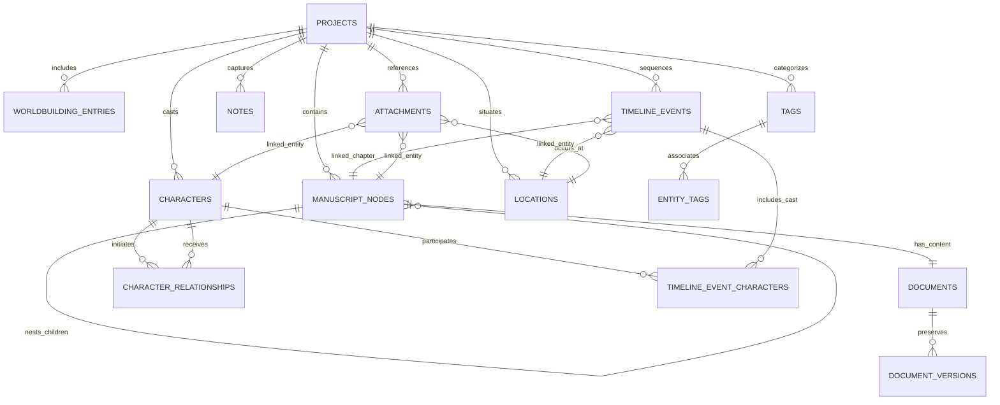

# Database Architecture & Schema Reference — WriteIn

WriteIn uses **SQLite 3** running via `rusqlite` bundled directly in the native Rust binary. 

## Pragmas & Safety Configuration
Every connection executes the following pragmas:
```sql
PRAGMA journal_mode = WAL;
PRAGMA foreign_keys = ON;
PRAGMA synchronous = NORMAL;
```

## Schema Versioning & Migrations
Migrations are managed in `src-tauri/src/db/migrations.rs`. Migrations are tracked via the `_migrations` table:
```sql
CREATE TABLE IF NOT EXISTS _migrations (
    id INTEGER PRIMARY KEY AUTOINCREMENT,
    version INTEGER NOT NULL UNIQUE,
    name TEXT NOT NULL,
    applied_at TEXT NOT NULL
);
```

- **Migration 001**: `001_initial_schema` (Core relational DDL across all initial domain tables).
- **Migration 002**: `002_manuscript_enhancements` (Adds `archived_at`, `sort_order`, and explicit ordering/timestamp indexes to `manuscript_nodes`).
- **Migration 003**: `003_organization_enhancements` (Adds flexible fictional calendar support `date_value`, `date_label`, `time_value` to `timeline_events`; creates `timeline_event_characters` junction; adds `archived_at` to `notes`; creates composite indexes).
- **Migration 004**: `004_secure_attachments_and_entity_linking` (Adds `mime_type`, `relative_path`, `entity_type`, `entity_id`, and `updated_at` to `attachments`; adds `idx_attachments_entity` and `idx_attachments_project_created`).

---

## Entity-Relationship Diagram (Mermaid)



---

## Relational Tables Specification

### 1. `projects`
Stores novel metadata, word count targets, and status.
```sql
CREATE TABLE IF NOT EXISTS projects (
    id TEXT PRIMARY KEY NOT NULL,
    title TEXT NOT NULL,
    subtitle TEXT,
    author TEXT,
    description TEXT,
    genre TEXT,
    status TEXT NOT NULL DEFAULT 'idea', -- 'idea', 'planning', 'writing', 'editing', 'completed', 'archived'
    target_word_count INTEGER NOT NULL DEFAULT 50000,
    current_word_count INTEGER NOT NULL DEFAULT 0,
    cover_image TEXT,
    project_notes TEXT,
    created_at TEXT NOT NULL,
    updated_at TEXT NOT NULL,
    archived_at TEXT
);
```

### 2. `manuscript_nodes`
Hierarchical tree for manuscript structure (Parts, Chapters, Scenes).
```sql
CREATE TABLE IF NOT EXISTS manuscript_nodes (
    id TEXT PRIMARY KEY NOT NULL,
    project_id TEXT NOT NULL,
    parent_id TEXT,
    node_type TEXT NOT NULL, -- 'folder', 'chapter', 'scene'
    title TEXT NOT NULL,
    synopsis TEXT,
    order_index INTEGER NOT NULL DEFAULT 0,
    sort_order INTEGER NOT NULL DEFAULT 0,
    status TEXT NOT NULL DEFAULT 'draft', -- 'draft', 'in_progress', 'complete', 'needs_revision'
    word_count INTEGER NOT NULL DEFAULT 0,
    created_at TEXT NOT NULL,
    updated_at TEXT NOT NULL,
    archived_at TEXT,
    FOREIGN KEY(project_id) REFERENCES projects(id) ON DELETE CASCADE,
    FOREIGN KEY(parent_id) REFERENCES manuscript_nodes(id) ON DELETE CASCADE
);
```

### 3. `documents`
Actual text and rich TipTap JSON content linked 1:1 to a manuscript node.
```sql
CREATE TABLE IF NOT EXISTS documents (
    id TEXT PRIMARY KEY NOT NULL,
    node_id TEXT NOT NULL UNIQUE,
    content_json TEXT NOT NULL DEFAULT '',
    content_text TEXT NOT NULL DEFAULT '',
    word_count INTEGER NOT NULL DEFAULT 0,
    character_count INTEGER NOT NULL DEFAULT 0,
    last_edited_at TEXT NOT NULL,
    FOREIGN KEY(node_id) REFERENCES manuscript_nodes(id) ON DELETE CASCADE
);
```

### 4. `characters` & `character_relationships`
Story cast and interactive relationship graph.
```sql
CREATE TABLE IF NOT EXISTS characters (
    id TEXT PRIMARY KEY NOT NULL,
    project_id TEXT NOT NULL,
    name TEXT NOT NULL,
    nickname TEXT,
    role TEXT NOT NULL DEFAULT 'supporting', -- 'protagonist', 'antagonist', 'supporting', 'minor'
    age TEXT,
    description TEXT,
    personality TEXT,
    appearance TEXT,
    background TEXT,
    goal TEXT,
    motivation TEXT,
    conflict TEXT,
    notes TEXT,
    avatar_path TEXT,
    sort_order INTEGER NOT NULL DEFAULT 0,
    custom_attributes TEXT, -- dynamic JSON key-value store
    created_at TEXT NOT NULL,
    updated_at TEXT NOT NULL,
    FOREIGN KEY(project_id) REFERENCES projects(id) ON DELETE CASCADE
);

CREATE TABLE IF NOT EXISTS character_relationships (
    id TEXT PRIMARY KEY NOT NULL,
    project_id TEXT NOT NULL,
    source_character_id TEXT NOT NULL,
    target_character_id TEXT NOT NULL,
    relation_type TEXT NOT NULL,
    description TEXT,
    created_at TEXT NOT NULL,
    updated_at TEXT NOT NULL,
    FOREIGN KEY(project_id) REFERENCES projects(id) ON DELETE CASCADE,
    FOREIGN KEY(source_character_id) REFERENCES characters(id) ON DELETE CASCADE,
    FOREIGN KEY(target_character_id) REFERENCES characters(id) ON DELETE CASCADE
);
```

### 5. `locations`
Story geography, architectural details, and sensory atmosphere.
```sql
CREATE TABLE IF NOT EXISTS locations (
    id TEXT PRIMARY KEY NOT NULL,
    project_id TEXT NOT NULL,
    name TEXT NOT NULL,
    location_type TEXT,
    description TEXT,
    appearance TEXT,
    atmosphere TEXT,
    inhabitants TEXT,
    notes TEXT,
    map_path TEXT,
    tags TEXT,
    created_at TEXT NOT NULL,
    updated_at TEXT NOT NULL,
    FOREIGN KEY(project_id) REFERENCES projects(id) ON DELETE CASCADE
);
```

### 6. `worldbuilding_entries`
World lore, factions, magic systems, religion, and culture.
```sql
CREATE TABLE IF NOT EXISTS worldbuilding_entries (
    id TEXT PRIMARY KEY NOT NULL,
    project_id TEXT NOT NULL,
    category TEXT NOT NULL, -- 'History', 'Culture', 'Magic System', 'Technology', 'Factions', 'Religion', 'Geography', 'Lore & Rules', 'General'
    title TEXT NOT NULL,
    content TEXT NOT NULL DEFAULT '',
    tags TEXT,
    created_at TEXT NOT NULL,
    updated_at TEXT NOT NULL,
    FOREIGN KEY(project_id) REFERENCES projects(id) ON DELETE CASCADE
);
```

### 7. `timeline_events` & `timeline_event_characters`
Chronological story timeline with custom fantasy calendar labels and participant junctions.
```sql
CREATE TABLE IF NOT EXISTS timeline_events (
    id TEXT PRIMARY KEY NOT NULL,
    project_id TEXT NOT NULL,
    title TEXT NOT NULL,
    event_date TEXT,
    date_value TEXT,
    date_label TEXT,
    time_value TEXT,
    order_index INTEGER NOT NULL DEFAULT 0,
    description TEXT,
    location_id TEXT,
    importance TEXT DEFAULT 'normal', -- 'critical', 'high', 'normal', 'low'
    related_chapter_id TEXT,
    tags TEXT,
    created_at TEXT NOT NULL,
    updated_at TEXT NOT NULL DEFAULT '',
    FOREIGN KEY(project_id) REFERENCES projects(id) ON DELETE CASCADE,
    FOREIGN KEY(location_id) REFERENCES locations(id) ON DELETE SET NULL,
    FOREIGN KEY(related_chapter_id) REFERENCES manuscript_nodes(id) ON DELETE SET NULL
);

CREATE TABLE IF NOT EXISTS timeline_event_characters (
    id TEXT PRIMARY KEY NOT NULL,
    event_id TEXT NOT NULL,
    character_id TEXT NOT NULL,
    FOREIGN KEY(event_id) REFERENCES timeline_events(id) ON DELETE CASCADE,
    FOREIGN KEY(character_id) REFERENCES characters(id) ON DELETE CASCADE,
    UNIQUE(event_id, character_id)
);
```

### 8. `notes`
Categorized story notes and plot scratchpad with pinning and soft archival.
```sql
CREATE TABLE IF NOT EXISTS notes (
    id TEXT PRIMARY KEY NOT NULL,
    project_id TEXT NOT NULL,
    category TEXT NOT NULL DEFAULT 'Ideas', -- 'Ideas', 'Research', 'Cut Content', 'Questions', 'General'
    title TEXT NOT NULL,
    content TEXT NOT NULL DEFAULT '',
    tags TEXT,
    is_pinned INTEGER NOT NULL DEFAULT 0,
    archived_at TEXT,
    created_at TEXT NOT NULL,
    updated_at TEXT NOT NULL,
    FOREIGN KEY(project_id) REFERENCES projects(id) ON DELETE CASCADE
);
```

### 9. `tags` & `entity_tags`
Cross-cutting organizational tags and polymorphic junction.
```sql
CREATE TABLE IF NOT EXISTS tags (
    id TEXT PRIMARY KEY NOT NULL,
    project_id TEXT NOT NULL,
    name TEXT NOT NULL,
    color TEXT,
    created_at TEXT NOT NULL DEFAULT '',
    updated_at TEXT NOT NULL DEFAULT '',
    FOREIGN KEY(project_id) REFERENCES projects(id) ON DELETE CASCADE,
    UNIQUE(project_id, name)
);

CREATE TABLE IF NOT EXISTS entity_tags (
    id TEXT PRIMARY KEY NOT NULL,
    tag_id TEXT NOT NULL,
    entity_type TEXT NOT NULL, -- 'manuscript', 'character', 'location', 'worldbuilding', 'timeline', 'note'
    entity_id TEXT NOT NULL,
    FOREIGN KEY(tag_id) REFERENCES tags(id) ON DELETE CASCADE
);
```

### 10. `attachments`
Secure filesystem reference file metadata and entity linking.
```sql
CREATE TABLE IF NOT EXISTS attachments (
    id TEXT PRIMARY KEY NOT NULL,
    project_id TEXT NOT NULL,
    file_name TEXT NOT NULL,
    file_path TEXT NOT NULL,
    relative_path TEXT,
    mime_type TEXT,
    file_type TEXT NOT NULL, -- 'image', 'pdf', 'document', 'audio', 'archive'
    file_size INTEGER NOT NULL DEFAULT 0,
    description TEXT,
    entity_type TEXT,
    entity_id TEXT,
    created_at TEXT NOT NULL,
    updated_at TEXT NOT NULL DEFAULT '',
    FOREIGN KEY(project_id) REFERENCES projects(id) ON DELETE CASCADE
);
```

### 11. `document_versions`
Snapshots for non-destructive version history and rollback.
```sql
CREATE TABLE IF NOT EXISTS document_versions (
    id TEXT PRIMARY KEY NOT NULL,
    document_id TEXT NOT NULL,
    node_id TEXT NOT NULL,
    version_num INTEGER NOT NULL DEFAULT 1,
    snapshot_text TEXT NOT NULL,
    word_count INTEGER NOT NULL DEFAULT 0,
    created_at TEXT NOT NULL,
    FOREIGN KEY(document_id) REFERENCES documents(id) ON DELETE CASCADE,
    FOREIGN KEY(node_id) REFERENCES manuscript_nodes(id) ON DELETE CASCADE
);
```

---

## Indexing & Performance Strategy

The database includes explicit indexes to support fast queries across thousands of items:

| Index Name | Table | Columns | Purpose |
| :--- | :--- | :--- | :--- |
| `idx_manuscript_project` | `manuscript_nodes` | `(project_id)` | Project tree queries |
| `idx_manuscript_parent` | `manuscript_nodes` | `(parent_id)` | Hierarchical child resolution |
| `idx_manuscript_sort_order`| `manuscript_nodes` | `(project_id, sort_order)` | Tree order sorting |
| `idx_manuscript_updated_at`| `manuscript_nodes` | `(updated_at)` | Recency filtering |
| `idx_timeline_sort_date` | `timeline_events` | `(project_id, date_value, order_index)` | Chronological spine sorting |
| `idx_timeline_chars_event`| `timeline_event_characters` | `(event_id)` | Fast participant lookup |
| `idx_timeline_chars_char` | `timeline_event_characters` | `(character_id)` | Character event backlink lookup |
| `idx_tags_project_name` | `tags` | `(project_id, name)` | Case-insensitive tag matching |
| `idx_entity_tags_lookup` | `entity_tags` | `(tag_id, entity_type, entity_id)` | Tagged entity queries |
| `idx_attachments_entity` | `attachments` | `(entity_type, entity_id)` | Entity attachment backlinks |
| `idx_attachments_project_created` | `attachments` | `(project_id, created_at DESC)` | Chronological attachments grid |
